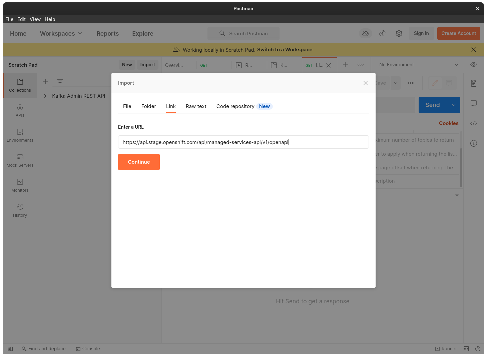
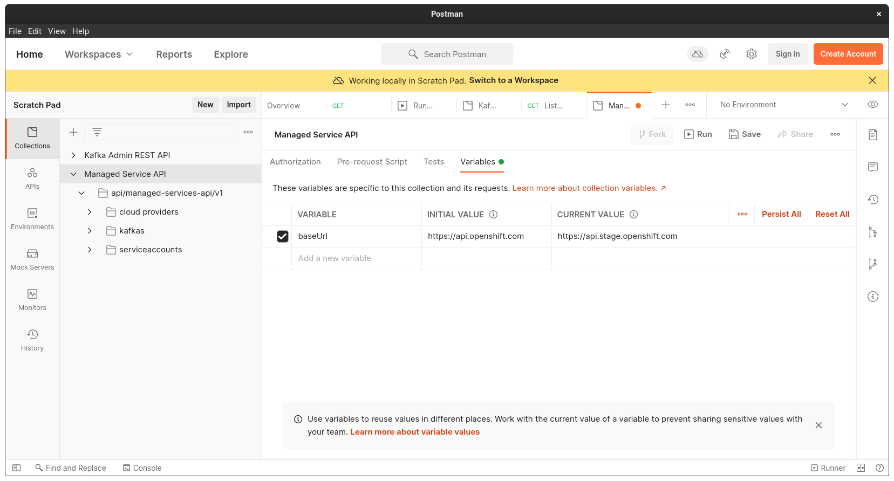
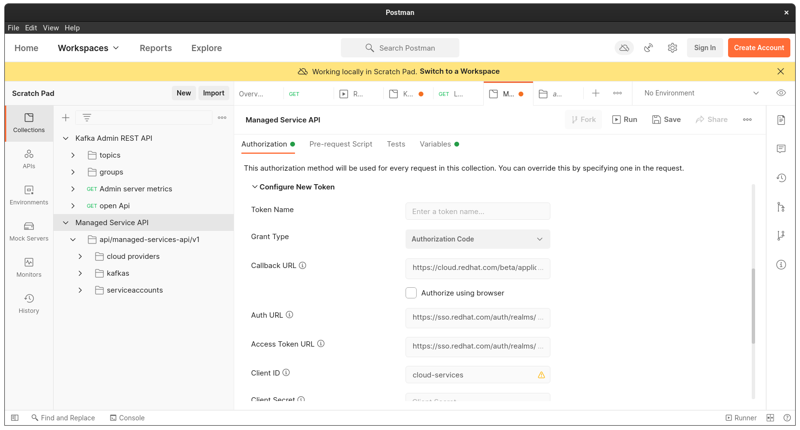

# Test managed-services-api with Postman

1. Download Postman

   https://www.postman.com/

1. Open Postman and import the openapi definition

   **staging:** `https://api.stage.openshift.com/api/managed-services-api/v1/openapi`

   **prod:** `https://api.openshift.com/api/managed-services-api/v1/openapi`

   

1. If testing against the staging environment you have to change the `baseUrl` variable

   

1. Under *Authorization* select `OAuth 2.0` as *Type* and configure the rest in this way:

    - *Grant Type:* `Authorization Code`
    - *Callback URL:* `https://cloud.redhat.com/beta/application-services/openshift-streams`
    - *Auth URL:* `https://sso.redhat.com/auth/realms/redhat-external/protocol/openid-connect/auth`
    - *Access Token URL:* `https://sso.redhat.com/auth/realms/redhat-external/protocol/openid-connect/token`
    - *Client ID:* `cloud-services`

   

1. Click on *Get New Access Token* to login and generate a new Token and click on *Use Token* to set it globally

1. You can now perform any API request using the global token by selecting `Inherit auth from parent` under *
   Authorization* in each request 

